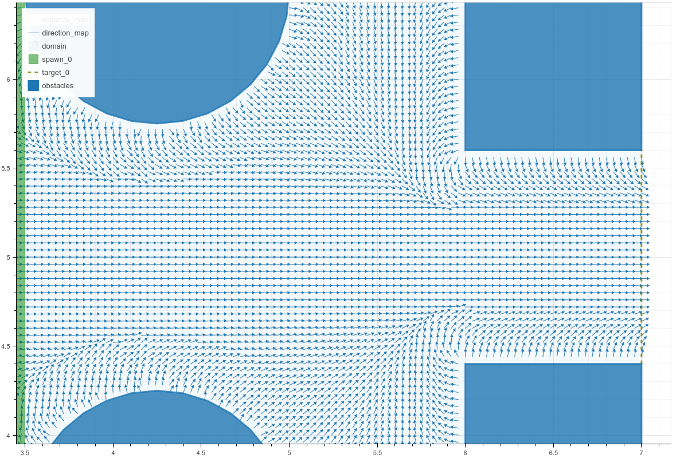

Steering
========

.. list-table:: Navigation Algorithms
   :header-rows: 1

   * - Algorithm
     - Type
     - Source
   * - Shortest Path
     - Discrete
     - [Kretz2011a]_, [Cristiani2015b]_
   * - Obstacle Handling
     - Discrete
     - [Cristiani2015b]_
   * - Herding
     - Continuous
     - [Helbing2000a]_

.. automodule:: crowddynamics.core.steering.navigation
   :noindex:

   *Example of vector field created by static potential which combines obstacle
   handling and shortest path algorithms*

.. autoclass:: crowddynamics.core.steering.navigation.static_potential
   :noindex:

.. automodule:: crowddynamics.core.steering.quickest_path
   :noindex:
   :members: distance_map, direction_map

.. automodule:: crowddynamics.core.steering.obstacle_handling
   :noindex:
   :members: obstacle_handling

.. autoclass:: crowddynamics.core.steering.functions.weighted_average
   :noindex:

.. autoclass:: crowddynamics.core.steering.collective_motion.herding_interaction
   :noindex:

.. automodule:: crowddynamics.core.steering.orientation
   :noindex:

References
----------
.. [Kretz2011a] Kretz, T., Große, A., Hengst, S., Kautzsch, L., Pohlmann, A., & Vortisch, P. (2011). Quickest Paths in Simulations of Pedestrians. Advances in Complex Systems, 14(5), 733–759. http://doi.org/10.1142/S0219525911003281
.. [Cristiani2015b] Cristiani, E., & Peri, D. (2015). Handling obstacles in pedestrian simulations: Models and optimization. Retrieved from http://arxiv.org/abs/1512.08528
