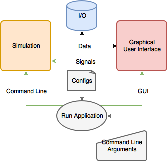

Application
===========

Architecture
------------

Simple graph of the architecture. Two main processes are

- Simulation
- Graphical User Interface (GUI)

Simulation generates data which can be stored in file by the I/O module and sent to the GUI to be displayed interactively. Simulation can be run either by

- Starting GUI and selecting simulation and running it
- Running the software from command line

Configuration Files
-------------------

Command Line Arguments
----------------------
-h, --help  Display help.
-l, --log   Set the logging level.

Tests
-----

Profiling
---------
