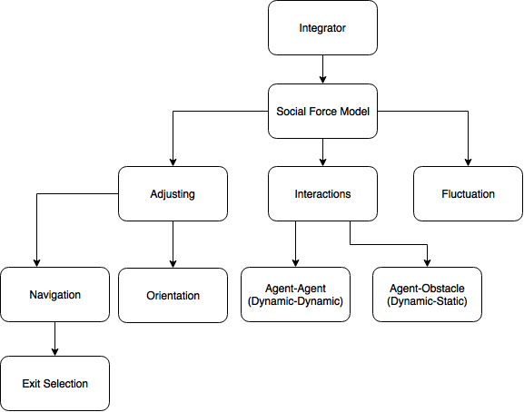

Multi-Agent
===========
.. Struture Tree, GraphViz, Architeture

Arhitecture

- **Microscopic** in nature. Agents are modelled as rigid bodies.
- **Continuous space**, :math:`\mathbb{R}^2`
- **Social force model** as a classical mechanics approach for modelling crowd movement.

Task graph

----

.. toctree::

   algorithms.rst
   social_force_model.rst
   adjusting.rst
   interactions.rst
   fluctuation.rst
   integrator.rst
   navigation.rst
   orientation.rst
   exit_selection.rst
   game.rst
