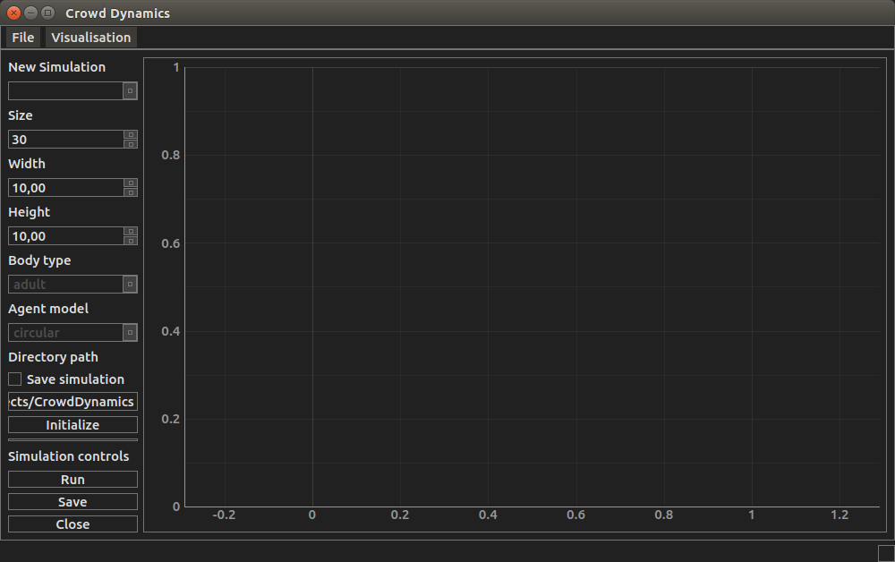

User Interface
==============

Graphics
--------
Graphical user interface and simulation graphics for crowd dynamics. Main window is created

- PyQt4 [pyqt4]_
- Layout for the main window is created by using Qt designer
- Graphics are implemented using pyqtgraph [pyqtgraph]_.

Design of the gui is greatly inspired and aided by the design of [rtgraph]_.

Communication
-------------
Communication with simulation data.

Input/Output
------------
Simulation data is stored to hdf5 file.

----

.. [pyqt4] Hess, D., & Summerfield, M. (2013). PyQt Whitepaper.

.. [pyqtgraph] Campagnola, L. (2014). PyQtGraph - Scientific Graphics
 and GUI Library for Python. Posledn{’\i} Aktualizace. article.
 Retrieved from http://www.pyqtgraph.org/

.. [rtgraph] Sepúlveda, S., Reyes, P., & Weinstein, A. (2015).
 Visualizing physiological signals in real-time.
 PROC. OF THE 14th PYTHON IN SCIENCE CONF.
 Retrieved from https://github.com/ssepulveda/RTGraph

