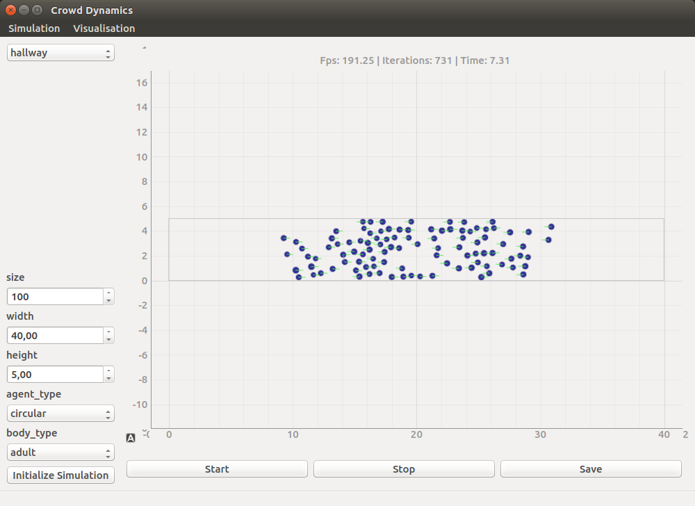

Usage
=====

Command-Line Interface
----------------------
.. todo:: Commandline tutorial (video, code)

After installation using the ``crowddynamics --help`` command in the commandline displays the available commands::

   Usage: crowddynamics [OPTIONS] COMMAND [ARGS]...

     CrowdDynamics <version>. A tool for building and running
     crowd simulations.

   Options:
     --version  Show the version and exit.
     --help     Show this message and exit.

   Commands:
     ...

Commandline interface can be used to create templates for new simulations and running simulations.

Graphical User Interface
------------------------
.. figure:: figures/crowddynamics-gui.png
   :target: _images/crowddynamics-gui.png
   :alt: Figure of crowddynamics GUI

.. todo:: GUI tutorial  (video, installation, code)

GUI can be used for visualization of crowddynamics simulations and display data interactively. This is very useful for designing new simulations and debugging.

Graphical user interface for crowddynamics implemented with Qt (pyqt wrappers) and pyqtgraph. It is maintained separately from the main ``crowddynamics`` repository due to dependencies on Qt. Repository can be found from crowddynamics-qtgui_.

.. _crowddynamics-qtgui: https://github.com/jaantollander/crowddynamics-qtgui

Creating New Simulations
------------------------
.. todo:: Add tutorial  (video, code)

There are some examples of how to write simulations inside ``crowddynamics/examples`` directory.

Running Simulations
-------------------
.. todo:: Add tutorial  (video, code)

Analysing Simulation Data
-------------------------
.. todo:: Add tutorial  (video, code)
